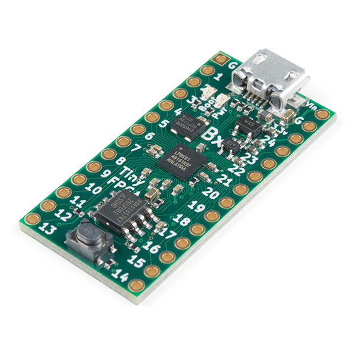

The following FPGA is used in this project. It is caching other matrix multiple rows and the first matrix is being streamed via USB directly. For such a small FPGA, I was able to achieve 14 MOPS/s.

Reference: I used [this repository](https://github.com/lawrie/tiny_usb_examples/tree/master/usb) for USB serial device fabric.

**FPGA Specifications:**
- Programming Interface: USB 2.0 full-speed (12 mbit/sec)
- ICE40LP8K FPGA
    - 7,680 four-input look-up-tables
    - 128KBit block RAM
    - Phase Locked Loop
    - 41 user IO pins
- 8MBit of SPI Flash
- Onboard 3.3 V (300 mA) and 1.2 V (150 mA) LDO regulators
- Low-Power 16 MHz MEMs Oscillator
    - 1.3 mA power when active
    - 50 ppm stability.

